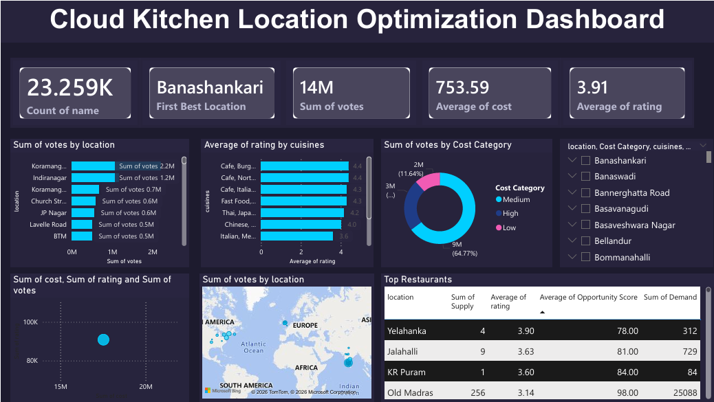

## 🚀 Cloud Kitchen Location Optimization using Data Analytics & Machine Learning

---

## 📖 Overview

This project identifies the **optimal location and cuisine for launching a cloud kitchen** using a data-driven approach. By analyzing restaurant data, customer demand, competition, pricing, and ratings, it provides actionable insights to support strategic business decisions.

---

## 🎯 Objective

* Identify **high-demand, low-competition locations**
* Analyze **customer preferences across cuisines**
* Evaluate **pricing vs quality trends**
* Predict restaurant success using **machine learning**

---

## 🧠 Methodology

* **Data Cleaning & Preprocessing** – handled missing values and standardized features
* **Exploratory Data Analysis (EDA)** – analyzed patterns in location, cuisine, cost, and ratings
* **Demand-Supply Analysis** – demand (votes) vs competition (restaurant count)
* **Opportunity Score** – identified high-potential locations
* **Machine Learning** – Random Forest model to predict restaurant ratings
* **Dashboard** – interactive Power BI dashboard for insights and decision-making

---

## 📊 Key Insights

* Some locations show **high demand with lower competition**, making them ideal for new cloud kitchens
* **North Indian and Chinese cuisines** dominate customer demand
* Higher cost does not guarantee better ratings
* **Location and customer engagement (votes)** strongly influence success

---

## 🎯 Outcome

Provides a **data-backed recommendation** for:

* Best location to open a cloud kitchen
* Most suitable cuisine to target
* Strategy to maximize business success

---

## 🛠️ Tools & Technologies

* Python (Pandas, NumPy, Matplotlib, Seaborn)
* Machine Learning (Scikit-learn – Random Forest)
* Power BI (Dashboard & Visualization)

---

## 📷 Dashboard Preview

